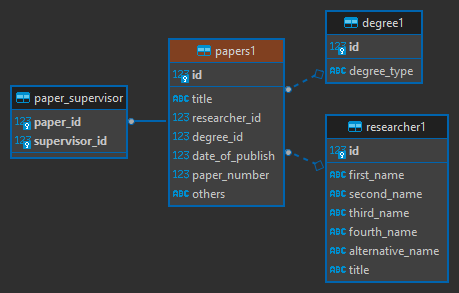
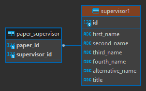

# kiial.org-papers-database-design
Database design for Khartoum International Institute for Arabic Language (KIIAL)'s research papers &nbsp;

> Implemented using Postgresql

**ER Diagram**



&nbsp;

Recommended using DBeaver or DataGrip to view and edit the data, or use `NVARCHAR` to avoid encoding problems.


can also use the following method to insert data as bytes:
&nbsp;

`INSERT INTO table(column) VALUES (N'Hassan');`

`INSERT INTO table (column) VALUES(N'حسن');`

## What's included


```text
main/
├── initial list 1
├── initial list 2
├── Database schema
├── cleaning supervisor and degree with sql
├── cleaning researcher with pandas/
|   ├── cleaning jupyter notebook
|   └── paper and reseacher files csv
└── finished/
    ├── Database_ERDigram
    ├── csv/
    |   ├── researcher
    |   ├── paper-supervisor
    |   ├── supervisor
    │   ├── degree
    │   └── papers
    └── sql/
        ├── researcher
        ├── paper-supervisor
        ├── supervisor
        ├── degree
        └── papers